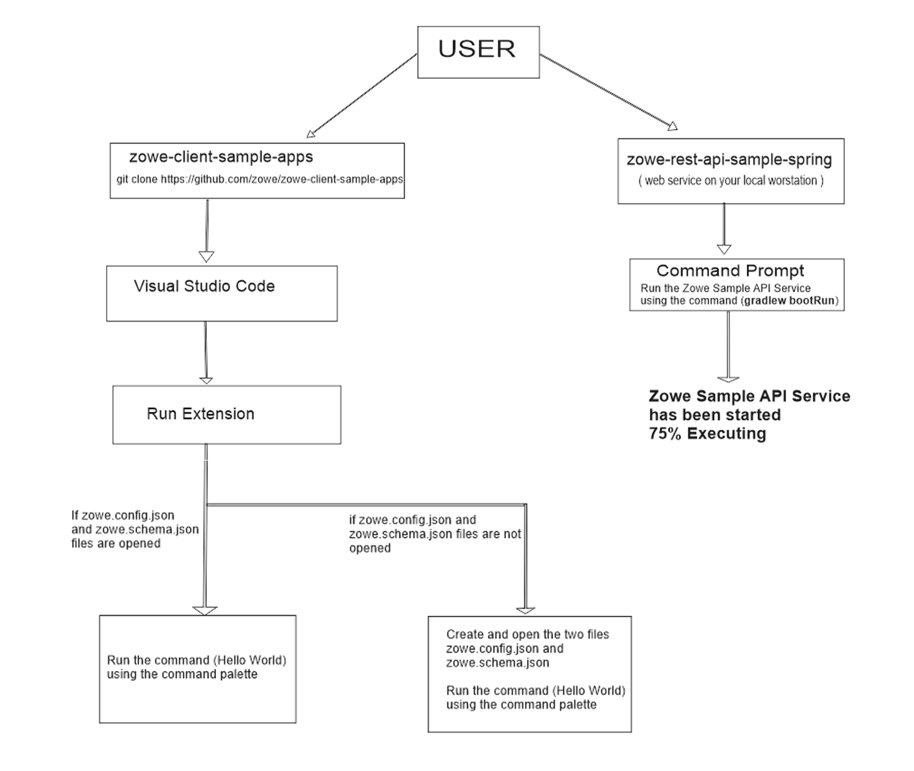

# [Zowe](https://www.zowe.org/) Explorer Extension Templates Detail design

 
  ## [Zowe-client-sample-apps](https://github.com/zowe/zowe-client-sample-apps) - The monorepo containing all codes for the API, CLI and VS code extension
  steps:
   * The monorepo should be opened in the visual studio code
   * Run Extension using the commad palette or F5 button
   * create and open the two file in the new vscode extension that you have just run, [zowe.config.json](https://github.com/zowe/zowe-client-sample-apps/blob/master/zowe.config.json) and [zowe.schema.json](https://github.com/zowe/zowe-client-sample-apps/blob/master/zowe.schema.json) as they contain connections for the backend service
   * continue with the process

  ## [Zowe Sample API service](https://github.com/zowe/sample-spring-boot-api-service/blob/master/zowe-rest-api-sample-spring/README.md)  - web service
  the [Zowe Sample API service](https://github.com/zowe/sample-spring-boot-api-service/blob/master/zowe-rest-api-sample-spring/README.md) is the backend service used in this project
  * for steps to build and run this web service in your local worstation see [here](https://github.com/zowe/sample-spring-boot-api-service/blob/master/zowe-rest-api-sample-spring/README.md)

