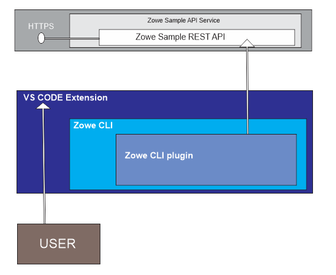

# [Zowe](https://www.zowe.org/) Explorer Extension Templates Architecture

## Components

  * ["Zowe Sample API service"](https://github.com/zowe/sample-spring-boot-api-service/blob/master/zowe-rest-api-sample-spring/README.md)  - web service
  * "Zowe CLI plug-in " will connect and get data from a REST API in ["Zowe Sample API service"](https://github.com/zowe/sample-spring-boot-api-service/blob/master/zowe-rest-api-sample-spring/README.md) and bring back response in JSON format
  * "VS Code extension" will be build on the developed "zowe CLI plug-in"
  * The "User" will interact with all these components through the generated "VS Code Extension"

## Technologies Used

* Typescript
* [Node.js](https://nodejs.org)